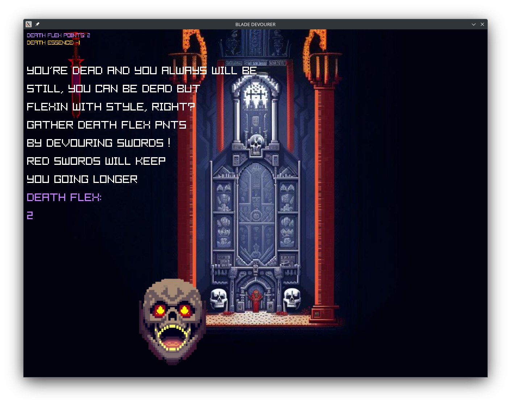

Blade Devourer is a simple Raylib based game created in the first interaction with the library. 
The project was started with an aim to learn the basics of the Raylib library and create a comparison point in project management progress before more complex projects in the future.

Game screen:

Credits:

Textures:
https://perchance.org/ai-pixel-art-generator
Sound:
https://pixabay.com/sound-effects/search/evil%20shreik/ 
Music:
https://pixabay.com/music/techno-trance-dark-dub-techno-somewhere-we-got-lost-no-copyright-music-144827/

